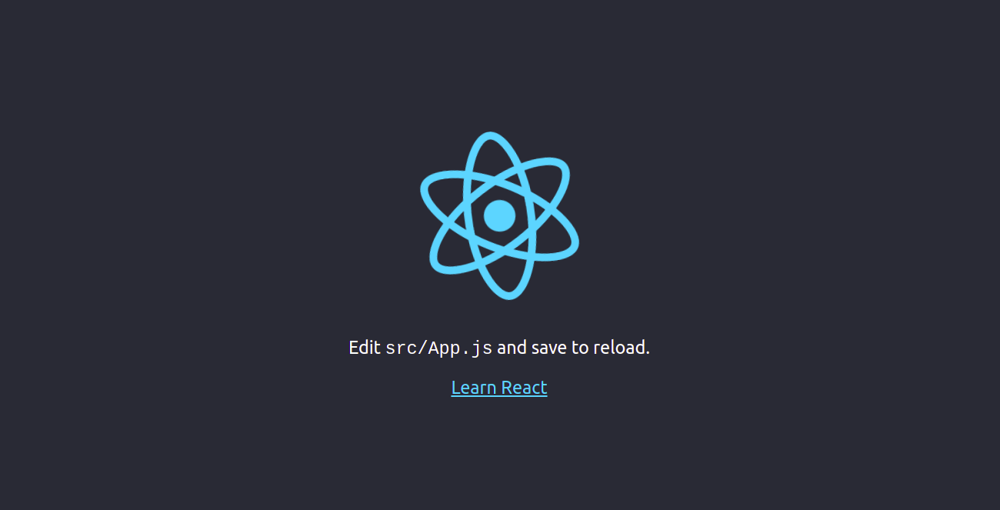

# TUTORIAL REACT JS 

## Projetos desenvolvidos seguindo o curso React - The complete Guide da plataforma Udemy

### Iniciando o curso:
Instale o nodejs (instruções para Ubuntu):
```
curl -fsSL https://deb.nodesource.com/setup_16.x | sudo -E bash -
sudo apt-get install -y nodejs
```

Execute o comando
```
npx create-react-app my-app
```
onde 'my-app' é o nome do diretório onde sera criado o projeto

Entre na pasta do projeto
```
cd my-app
```
O projeto pode ser executado com 
```
npm start
```
Se tudo correr bem, o browser deve exibir uma pagina semelhante a seguinte imagem

